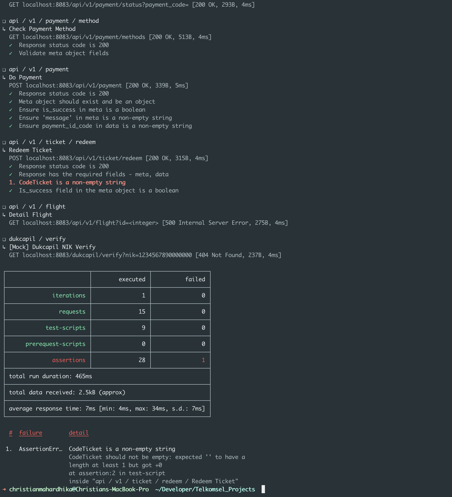

# FWW (Fly Without Wings) Solution
## Description
This is a solution for the FWW (Fly Without Wings) problem. The problem is to find the shortest path from a given source to a given destination in a graph. The graph is given as a list of edges. The solution is implemented in Go and use Bonita BPMN 2.0 engine to execute the process.

## Sequence Diagram

## System Design

## ERD

## API Documentation

### Postman Collection

### Swagger

## How to run

### Prerequisites

### Run

## How to test

### Unit Test

### E2E Test

## How to deploy

### Docker Local

### Deploy to Kubernetes

## How to monitor
