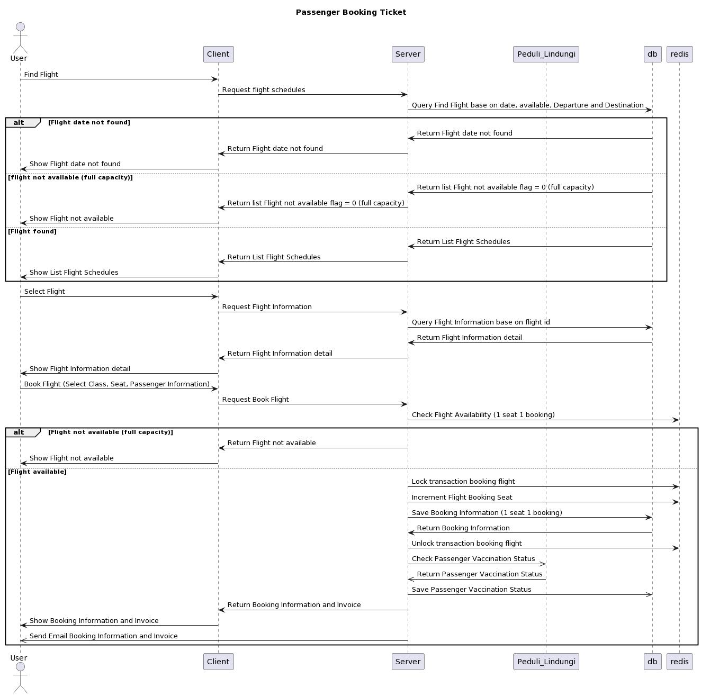

# FWW (Fly Without Wings) Solution
## Description
This is a solution for the FWW (Fly Without Wings) problem. The problem is to find the shortest path from a given source to a given destination in a graph. The graph is given as a list of edges. The solution is implemented in Go and use Bonita BPMN 2.0 engine to execute the process.

## Sequence Diagram

### Passenger Sequence Diagram


### Booking Sequence Diagram



### Payment Sequence Diagram


### Redeem Ticket Sequence Diagram


## System Design


## ERD


## API Documentation

To view the API documentation, please run the application and go to the following URL:

### Postman Collection

[https://www.getpostman.com/collections](https://www.getpostman.com/collections/4625022-61aa55ac-dd32-4406-9cc8-f9e3134d80d0)

### Swagger

[https://fww-solution.github.io/.github/](https://fww-solution.github.io/.github/)

## How to run

## Repositories

All repositories are hosted on GitHub. The following is the list of repositories:

- https://github.com/fww-solution/fww-wrapper.git

- https://github.com/fww-solution/fww-core.git

- https://github.com/fww-solution/bpm-wrapper.git

- https://github.com/fww-solution/bpm-rintime.git

### Prerequisites

(run locally)
Docker already installed

Clone sre repository

```bash
git clone https://github.com/fww-solution/fww-sre.git
```

```bash
cd deploy/local
docker-compose up -d
```

### Run

## How to test

### Security Test

To perform security test at [fww-core service](https://github.com/fww-solution/fww-core.git), please run the following command:

```bash
make scan
```

### Unit Test

To perform unit test at [fww-core service](https://github.com/fww-solution/fww-core.git), please run the following command:

```bash
make test
```

### E2E Test

## How to deploy

### Docker Local

### Deploy to Kubernetes

## How to monitor
